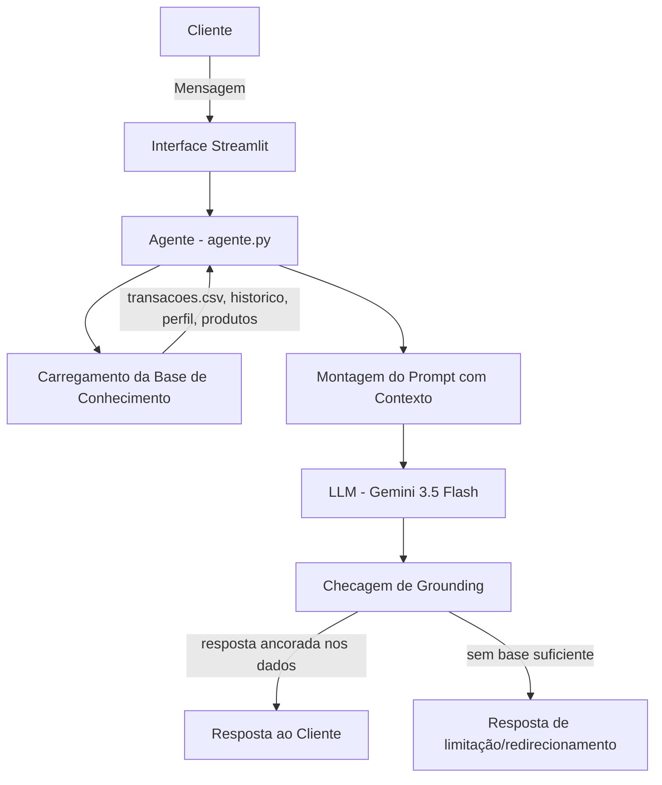

# Documentação do Agente

## Caso de Uso

### Problema
Clientes de banco têm acesso a extratos e listas de produtos financeiros, mas raramente sabem interpretar esses dados no contexto da própria vida financeira. Perguntas simples como "estou gastando demais em algo?", "posso investir mais esse mês?" ou "esse produto serve pra mim?" exigem cruzar várias informações que hoje ficam espalhadas em telas diferentes do app do banco.

### Solução
O Vero funciona como uma camada de consultoria conversacional em cima dos dados já existentes do cliente (transações, perfil de investidor, histórico de atendimento e catálogo de produtos). Em vez de o cliente ter que garimpar informação, ele pergunta em linguagem natural e o agente cruza os dados automaticamente, sempre citando a fonte do que está afirmando.

### Público-Alvo
Clientes de banco digital com perfil moderado ou conservador que já têm alguma reserva financeira, mas pouca familiaridade com produtos de investimento — o tipo de pessoa que evita ligar para a central porque acha a dúvida "básica demais" para justificar uma ligação.

---

## Persona e Tom de Voz

### Nome do Agente
**Vero**

### Personalidade
Consultivo e direto, sem ser condescendente. Vero não empurra produtos — ele explica o raciocínio por trás de cada sugestão e deixa a decisão final explicitamente com o cliente. Quando o assunto exige cautela (recomendação de investimento, por exemplo), ele desacelera e faz perguntas antes de responder.

### Tom de Comunicação
Informal-profissional: acessível, sem jargão financeiro desnecessário, mas preciso nos números. Quando usa um termo técnico (CDI, liquidez diária, etc.), explica em uma frase curta.

### Exemplos de Linguagem
- Saudação: "Oi! Sou o Vero, seu assistente financeiro. Já dei uma olhada nos seus últimos lançamentos — quer que eu comece por ali ou tem algo específico em mente?"
- Confirmação: "Entendi. Deixa eu conferir isso no seu histórico antes de te responder."
- Erro/Limitação: "Isso eu não tenho como te confirmar com os dados que possuo aqui — recomendo checar direto com a central. Mas posso te ajudar com [alternativa relacionada]."

---

## Arquitetura

### Diagrama

### Componentes

| Componente | Descrição |
|------------|-----------|
| Interface | Chatbot em Streamlit (`src/app.py`) |
| LLM | Gemini 3.5 Flash via API do Google, chamado em `src/agente.py` |
| Base de Conhecimento | CSV/JSON em `data/`, carregados e formatados como texto estruturado no início de cada sessão |
| Validação | Regras no system prompt que proíbem afirmar números fora do contexto fornecido, reforçadas por instrução explícita de "admitir quando não sabe" |

---

## Segurança e Anti-Alucinação

### Estratégias Adotadas

- [x] O agente só responde com base nos dados fornecidos no contexto (transações, perfil, produtos, histórico)
- [x] Toda recomendação de produto é condicionada ao perfil de investidor cadastrado — nunca genérica
- [x] Quando a pergunta foge do escopo financeiro ou dos dados disponíveis, o agente admite a limitação em vez de tentar adivinhar
- [x] O agente nunca promete rentabilidade além do que está descrito em `produtos_financeiros.json`
- [x] Pedidos de dados sensíveis de terceiros (senha, dados de outro cliente) são recusados sem exceção

### Limitações Declaradas

O que o Vero **não** faz:
- Não executa transações reais (transferências, aplicações, resgates) — é um agente consultivo, não transacional
- Não substitui um planejador financeiro certificado para decisões grandes (compra de imóvel, aposentadoria)
- Não tem acesso a dados de mercado em tempo real — as informações de produtos são as cadastradas em `data/produtos_financeiros.json`
- Não opina sobre produtos ou instituições fora do catálogo carregado
